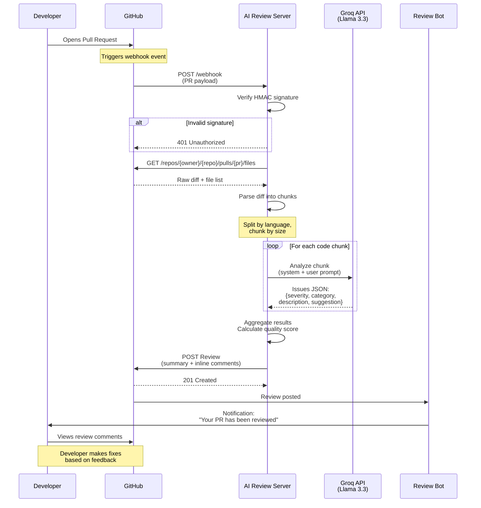
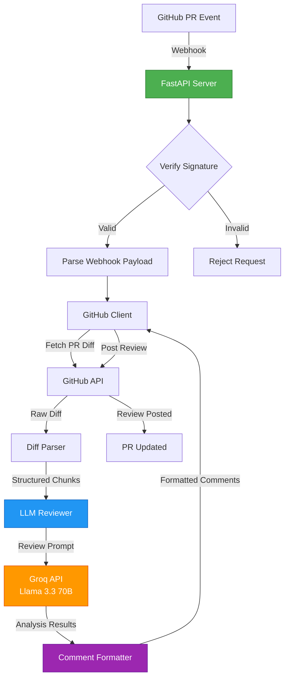
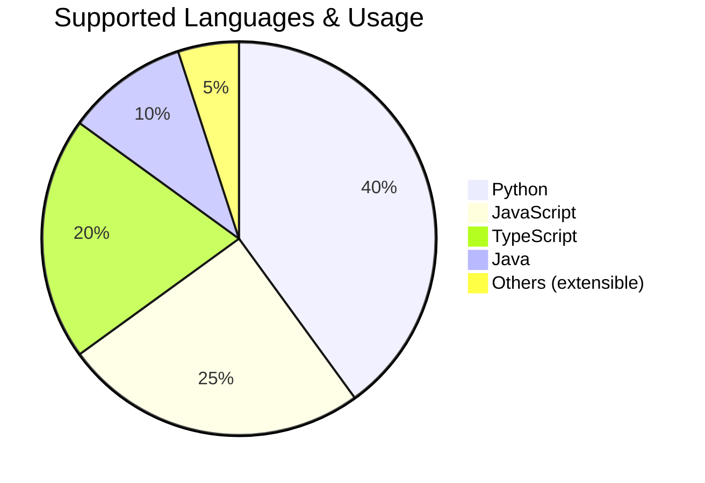

# 🤖 AI Code Review Agent
> **Automated PR code review powered by LLMs** — Detect bugs, security issues, and code quality problems automatically

## Project Description
The AI Code Review Agent is a FastAPI-based webhook server that automates the code review process for GitHub pull requests. It utilizes LLMs (Large Language Models) from Groq to analyze code changes and provide feedback in the form of inline comments and a summary comment.

## Key Features
- 🔍 **Automated PR Reviews**: Analyzes pull requests and posts inline comments automatically
- 🧠 **LLM-Powered**: Uses Groq's Llama 3.3 70B model for intelligent code analysis
- 🐛 **Multi-Category Detection**: Identifies bugs, security vulnerabilities, performance issues, and code style problems
- 💬 **Inline Comments**: Posts feedback directly on the relevant lines
- 📊 **Quality Scores**: Gives an overall code quality rating (0-10)
- 🚀 **Multiple Deployment Options**: Supports GitHub Action, Webhook server, and standalone CLI deployment
- 🌐 **Multi-Language Support**: Currently supports Python, JavaScript, TypeScript, and Java

---

## 📸 Example: AI Code Review in Action

### Inline Comment Example

```
┌─────────────────────────────────────────────────────────────────────┐
│ 🟡 WARNING — Potential Null Pointer Risk                           │
│                                                                     │
│ Category: bug                                                       │
│                                                                     │
│ The variable `user_data` is accessed without checking if it's      │
│ None. This could lead to an AttributeError at runtime if the       │
│ database query returns no results.                                 │
│                                                                     │
│ Suggested fix:                                                      │
│ ┌─────────────────────────────────────────────────────────────┐   │
│ │ # Add null check before accessing                           │   │
│ │ if user_data is None:                                       │   │
│ │     return {"error": "User not found"}                      │   │
│ │ return user_data.to_dict()                                  │   │
│ └─────────────────────────────────────────────────────────────┘   │
│                                                                     │
│ 🤖 Posted by AI Code Review Agent                                  │
└─────────────────────────────────────────────────────────────────────┘
```

### PR Summary Example

```
┌────────────────────────────────────────────────────────────────────┐
│ 🤖 AI Code Review Summary                                          │
│                                                                    │
│ Quality Score: 7.5/10 🟢🟢🟢🟢🟢🟢🟢🟢⚫⚫                          │
│                                                                    │
│ ┌──────────────────────┬──────────┐                               │
│ │ Metric               │ Count    │                               │
│ ├──────────────────────┼──────────┤                               │
│ │ Total Issues         │ 5        │                               │
│ │ 🔴 Critical          │ 1        │                               │
│ │ 🟡 Warnings          │ 3        │                               │
│ │ Files Reviewed       │ 8        │                               │
│ └──────────────────────┴──────────┘                               │
│                                                                    │
│ Summary: Found 5 issue(s) across 8 file(s). Overall quality       │
│ score: 7.5/10.                                                     │
│                                                                    │
│ 📁 File Breakdown                                                  │
│                                                                    │
│ - `src/app.py` — ⚠️ 2 issue(s)                                    │
│ - `src/github_client.py` — ✅                                     │
│ - `src/llm_reviewer.py` — ⚠️ 1 issue(s)                           │
│ - `src/diff_parser.py` — ✅                                       │
│ - `src/models.py` — ⚠️ 2 issue(s)                                 │
│                                                                    │
│ ---                                                                │
│ Powered by AI Code Review Agent 🤖                                 │
└────────────────────────────────────────────────────────────────────┘
```

---

## Technology Stack
- **FastAPI**: Web framework for building the webhook server
- **Groq**: Provides LLMs for code analysis
- **Pydantic**: Used for data validation and configuration management
- **httpx**: Async HTTP client for GitHub API interactions
- **Python 3.11+**: Required Python version for the project

## Installation & Setup
To set up the AI Code Review Agent, follow these steps:
1. Clone the repository: `git clone https://github.com/yourusername/ai-code-review-agent.git`
2. Create a virtual environment: `python -m venv .venv` and activate it
3. Install dependencies: `pip install -r requirements-dev.txt`
4. Create a `.env` file and add your Groq API key and GitHub token
5. Run the server: `uvicorn src.app:app --reload`

## Usage Examples
### Option 1: GitHub Action
Add the following to your `.github/workflows/ai-review.yml` file:
```yaml
name: AI Code Review

on:
  pull_request:
    types: [opened, synchronize, reopened]

permissions:
  pull-requests: write
  contents: read

jobs:
  review:
    runs-on: ubuntu-latest
    steps:
      - uses: actions/checkout@v4
      - name: AI Code Review
        uses: yourusername/ai-code-review-agent@v1
        with:
          groq_api_key: ${{ secrets.GROQ_API_KEY }}
          github_token: ${{ secrets.GITHUB_TOKEN }}
```
### Option 2: Webhook Server
1. Clone the repository and create a `.env` file
2. Run the server: `uvicorn src.app:app --reload`
3. Expose the server to the internet using ngrok: `ngrok http 8000`
4. Configure a GitHub webhook with the ngrok URL

## Project Structure
```markdown
src/
app.py
config.py
diff_parser.py
github_client.py
llm_reviewer.py
comment_formatter.py
models.py
tests/
...
requirements-dev.txt
requirements.txt
README.md
LICENSE
```
## API/Architecture Overview

The AI Code Review Agent uses a modular architecture to process GitHub PR webhooks and generate intelligent code reviews.

### Detailed Workflow Sequence



### Component Architecture



### Key Components

| Component | File | Responsibility |
|-----------|------|----------------|
| **Webhook Server** | [`app.py`](src/app.py) | Receives GitHub events, orchestrates review process |
| **GitHub Client** | [`github_client.py`](src/github_client.py) | Async wrapper for GitHub API operations |
| **Diff Parser** | [`diff_parser.py`](src/diff_parser.py) | Parses unified diffs into structured chunks |
| **LLM Reviewer** | [`llm_reviewer.py`](src/llm_reviewer.py) | Core review engine using Groq LLMs |
| **Comment Formatter** | [`comment_formatter.py`](src/comment_formatter.py) | Formats results as GitHub markdown |
| **Models** | [`models.py`](src/models.py) | Pydantic data models for type safety |
| **Config** | [`config.py`](src/config.py) | Settings and environment management |

### Language Support Distribution




## Configuration
All settings are configured via environment variables (or `.env` file):
| Variable | Required | Default | Description |
|----------|----------|---------|-------------|
| `GROQ_API_KEY` | ✅ Yes | - | Your Groq API key |
| `GITHUB_TOKEN` | ✅ Yes | - | GitHub Personal Access Token |
| `LLM_MODEL` | No | `llama-3.3-70b-versatile` | Groq model to use |
| `MAX_FILES_PER_REVIEW` | No | `20` | Max files to review per PR |
| `MAX_DIFF_LINES` | No | `500` | Max diff lines per chunk |
| `REVIEW_LANGUAGES` | No | `python,javascript,typescript,java` | Comma-separated list of languages to review |

## Testing
To run tests, use the following commands:
```bash
# Run all tests
pytest tests/ -v

# Run with coverage
pytest tests/ -v --cov=src --cov-report=html

# Lint
ruff check src/ tests/

# Type check
mypy src/
```
## Contributing Guidelines
Contributions are welcome! Please follow these steps:
1. Fork the repository
2. Create a feature branch (`git checkout -b feature/amazing-feature`)
3. Commit your changes (`git commit -m 'Add amazing feature'`)
4. Push to the branch (`git push origin feature/amazing-feature`)
5. Open a Pull Request

## License Info
This project is licensed under the MIT License - see the [LICENSE](LICENSE) file for details.

## Git Statistics Summary
- Total Commits: 3
- Contributors: 1 (MihirJayswal812007)
- Recent Commits:
  - a322f6e: Test: dashboard feature
  - b29097a: Add dashboard and GitHub PR links to reviews
  - 5d3d5db: Initial commit: AI Code Review Agent