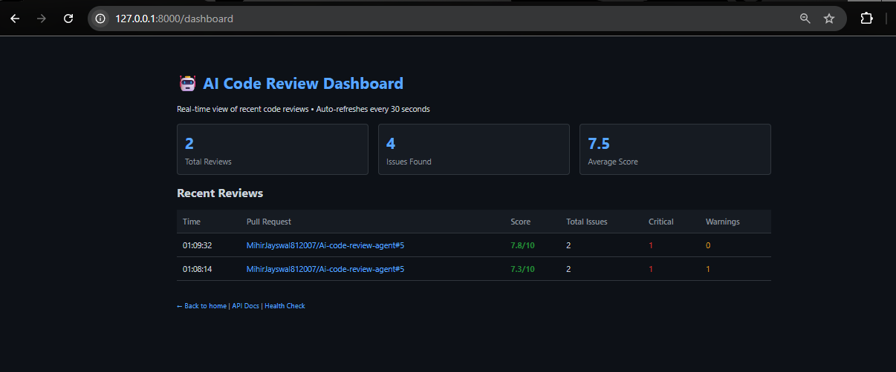
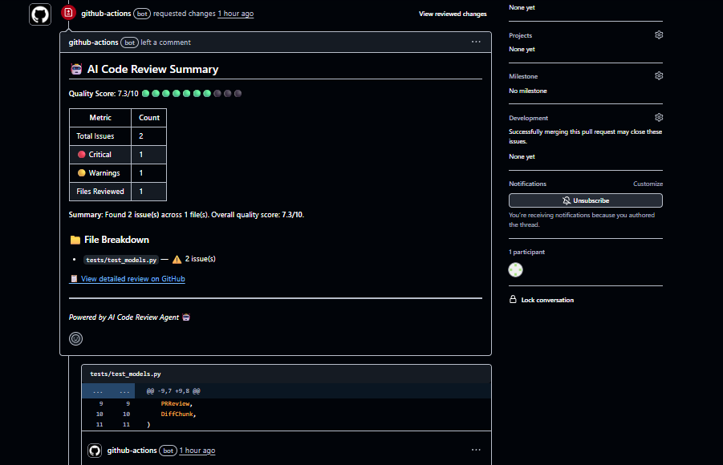
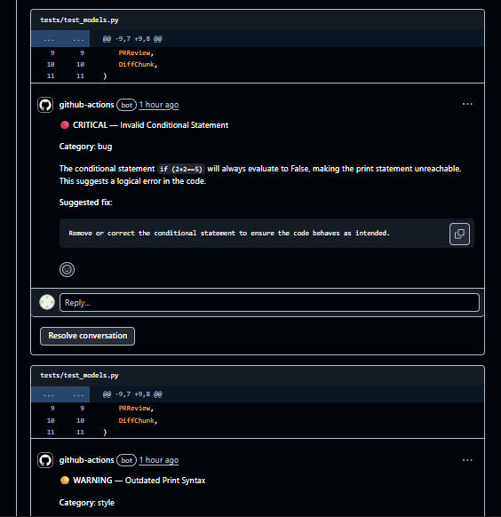

# 🤖 AI Code Review Agent

> **Automated PR code review powered by LLMs** — Detect bugs, security issues, and code quality problems automatically.

[](https://github.com/MihirJayswal812007/Ai-code-review-agent/actions)
[](https://opensource.org/licenses/MIT)
[](https://www.python.org/downloads/)

---

## 📸 Screenshots & Demo

### 📊 Real-Time Dashboard
View recent reviews, quality scores, and issues in real-time. Data is persisted securely.


*(Run the agent locally to see the dashboard at `http://localhost:8000/dashboard`)*

### 💬 Intelligent PR Comments
The agent posts inline comments with code suggestions and explanations.




---

## ✨ Features

- 🔍 **Automated PR Reviews** — Analyzes pull requests and posts inline comments automatically.
- 🧠 **LLM-Powered** — Uses **Groq** (Llama 3.3 70B) for intelligent, context-aware code analysis.
- 💾 **Persistent Dashboard** — SQLite-backed dashboard to track review history and stats.
- ⚡ **Rate Limiting** — Built-in protection (10 reviews/min) to respect API quotas.
- 🛡️ **Security First** — Webhook signature verification and secret management.
- 🌐 **Multi-Language Support** — Python, JavaScript, TypeScript, Java, Go, Rust, Ruby, C++, C, C#.
- 🐛 **Comprehensive Detection**:
  - **Bugs & Logic Errors**
  - **Security Vulnerabilities** (SQLi, XSS, Secrets)
  - **Performance Issues**
  - **Code Style & Best Practices**
- 💰 **100% Free** — Optimized for Groq's free tier.

---

## 🚀 Quick Start

### Option 1: Local Development (Recommended)

1. **Clone the repo**
   ```bash
   git clone https://github.com/MihirJayswal812007/Ai-code-review-agent.git
   cd ai-code-review-agent
   ```

2. **Setup Environment**
   ```bash
   python -m venv .venv
   source .venv/bin/activate  # Windows: .venv\Scripts\activate
   pip install -r requirements.txt
   ```

3. **Configure .env**
   ```bash
   cp .env.example .env
   # Edit .env and add your GROQ_API_KEY and GITHUB_TOKEN
   ```

4. **Run the Server**
   ```bash
   uvicorn src.app:app --reload
   ```

5. **Expose to the Internet** (for GitHub Webhooks)
   ```bash
   ngrok http 8000
   ```
   Copy the ngrok URL (e.g., `https://your-url.ngrok-free.app`) to your GitHub Webhook settings.

---

### Option 2: GitHub Action

Add this to `.github/workflows/ai-review.yml`:

```yaml
name: AI Code Review
on:
  pull_request:
    types: [opened, synchronize]
permissions:
  pull-requests: write
  contents: read
jobs:
  review:
    runs-on: ubuntu-latest
    steps:
      - uses: actions/checkout@v4
      - name: AI Code Review
        uses: MihirJayswal812007/ai-code-review-agent@v1
        with:
          groq_api_key: ${{ secrets.GROQ_API_KEY }}
          github_token: ${{ secrets.GITHUB_TOKEN }}
```

---

## 📋 Configuration

| Variable | Required | Default | Description |
|----------|----------|---------|-------------|
| `GROQ_API_KEY` | ✅ Yes | - | Your Groq API key |
| `GITHUB_TOKEN` | ✅ Yes | - | GitHub Token (needs `repo` or PR write permissions) |
| `GITHUB_WEBHOOK_SECRET` | ⚠️ Rec | - | Output of `openssl rand -hex 20` for signature verification |
| `LLM_MODEL` | No | `llama-3.3-70b-versatile` | Groq model to use |
| `MAX_FILES_PER_REVIEW` | No | `20` | Max files to review per PR |
| `REVIEW_LANGUAGES` | No | `python,javascript,typescript,java,go,rust,ruby,cpp,c,csharp` | Supported languages |

---

## 🏗️ Architecture


## 🧪 Testing

```bash
# Run unit tests
pytest tests/ -v

# Run manual fix verification
python test_fixes_sync.py
```

## 🤝 Contributing

1. Fork the repo
2. Create your feature branch (`git checkout -b feature/amazing-feature`)
3. Commit your changes (`git commit -m 'Add amazing feature'`)
4. Push to the branch (`git push origin feature/amazing-feature`)
5. Open a Pull Request

---

**⭐ Star this repo if you find it useful!**
