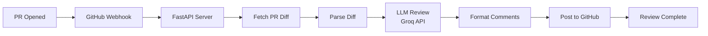

# 🤖 AI Code Review Agent

> **Automated PR code review powered by LLMs** — Detect bugs, security issues, and code quality problems automatically

[](https://github.com/yourusername/ai-code-review-agent/actions)
[](https://opensource.org/licenses/MIT)
[](https://www.python.org/downloads/)


---

## ✨ Features

- 🔍 **Automated PR Reviews** — Analyzes pull requests and posts inline comments automatically
- 🧠 **LLM-Powered** — Uses Groq (free tier) with Llama 3.3 70B for intelligent code analysis
- 🐛 **Multi-Category Detection**:
  - Bugs & logic errors
  - Security vulnerabilities (SQL injection, XSS, hardcoded secrets)
  - Performance issues (N+1 queries, memory leaks)
  - Code style & best practices
- 💬 **Inline Comments** — Posts feedback directly on the relevant lines
- 📊 **Quality Scores** — Gives an overall code quality rating (0-10)
- 🚀 **Multiple Deployment Options**:
  - GitHub Action (easiest)
  - Webhook server (Docker)
  - Standalone CLI
- 🌐 **Multi-Language Support** — Python, JavaScript, TypeScript, Java (extensible)
- 💰 **100% Free** — Uses Groq's free tier (30 requests/min)

---

## 🚀 Quick Start

### Option 1: GitHub Action (Recommended)

Add this to `.github/workflows/ai-review.yml` in your repo:

```yaml
name: AI Code Review

on:
  pull_request:
    types: [opened, synchronize, reopened]

permissions:
  pull-requests: write
  contents: read

jobs:
  review:
    runs-on: ubuntu-latest
    steps:
      - uses: actions/checkout@v4
      
      - name: AI Code Review
        uses: yourusername/ai-code-review-agent@v1
        with:
          groq_api_key: ${{ secrets.GROQ_API_KEY }}
          github_token: ${{ secrets.GITHUB_TOKEN }}
```

Then add your Groq API key to GitHub Secrets:
1. Get a free API key from [console.groq.com](https://console.groq.com)
2. Go to your repo → Settings → Secrets → New repository secret
3. Name: `GROQ_API_KEY`, Value: your key

### Option 2: Webhook Server (Docker)

```bash
# 1. Clone the repo
git clone https://github.com/yourusername/ai-code-review-agent.git
cd ai-code-review-agent

# 2. Create .env file
cp .env.example .env
# Edit .env and add your GROQ_API_KEY and GITHUB_TOKEN

# 3. Run with Docker Compose
docker-compose up -d

# 4. Expose to internet (for webhooks)
ngrok http 8000
```

Then configure a GitHub webhook:
- Go to repo → Settings → Webhooks → Add webhook
- Payload URL: `https://your-ngrok-url.ngrok.io/webhook`
- Content type: `application/json`
- Events: Pull requests
- Save

### Option 3: Local Development

```bash
# 1. Clone and setup
git clone https://github.com/yourusername/ai-code-review-agent.git
cd ai-code-review-agent

# 2. Create virtual environment
python -m venv .venv
source .venv/bin/activate  # Windows: .venv\Scripts\activate

# 3. Install dependencies
pip install -r requirements-dev.txt

# 4. Create .env file
cp .env.example .env
# Edit .env and add your API keys

# 5. Run tests
pytest tests/ -v

# 6. Run the server
uvicorn src.app:app --reload
```

---

## 📋 Configuration

All settings are configured via environment variables (or `.env` file):

| Variable | Required | Default | Description |
|----------|----------|---------|-------------|
| `GROQ_API_KEY` | ✅ Yes | - | Your Groq API key ([get one](https://console.groq.com)) |
| `GITHUB_TOKEN` | ✅ Yes | - | GitHub Personal Access Token or use `${{ secrets.GITHUB_TOKEN }}` in Actions |
| `LLM_MODEL` | No | `llama-3.3-70b-versatile` | Groq model to use |
| `MAX_FILES_PER_REVIEW` | No | `20` | Max files to review per PR |
| `MAX_DIFF_LINES` | No | `500` | Max diff lines per chunk |
| `REVIEW_LANGUAGES` | No | `python,javascript,typescript,java` | Comma-separated list of languages to review |
| `HOST` | No | `0.0.0.0` | Server host (webhook mode) |
| `PORT` | No | `8000` | Server port (webhook mode) |
| `LOG_LEVEL` | No | `info` | Logging level |

---

## 🏗️ Architecture



**Key Components:**

- **`src/app.py`** — FastAPI webhook receiver
- **`src/github_client.py`** — Async GitHub API wrapper
- **`src/diff_parser.py`** — Unified diff parser
- **`src/llm_reviewer.py`** — Core LLM review engine
- **`src/comment_formatter.py`** — GitHub markdown formatter
- **`src/models.py`** — Pydantic data models
- **`src/config.py`** — Configuration management

---

## 🧪 Testing

```bash
# Run all tests
pytest tests/ -v

# Run with coverage
pytest tests/ -v --cov=src --cov-report=html

# Lint
ruff check src/ tests/

# Type check
mypy src/
```

---

## 📸 Screenshots

### Example Review Comment


### Summary Comment


---

## 🛣️ Roadmap

- [ ] Auto-fix suggestions (one-click apply)
- [ ] Custom review rules via `.codereview.yml`
- [ ] Review history dashboard (React frontend)
- [ ] Support for GitLab and Bitbucket
- [ ] Slack/Discord notifications
- [ ] More language support (Go, Rust, C++)

---

## 🤝 Contributing

Contributions are welcome! Please follow these steps:

1. Fork the repo
2. Create a feature branch (`git checkout -b feature/amazing-feature`)
3. Commit your changes (`git commit -m 'Add amazing feature'`)
4. Push to the branch (`git push origin feature/amazing-feature`)
5. Open a Pull Request

---

## 📄 License

This project is licensed under the MIT License - see the [LICENSE](LICENSE) file for details.

---

## 🙏 Acknowledgments

- [Groq](https://groq.com) for blazing-fast LLM inference
- [FastAPI](https://fastapi.tiangolo.com) for the excellent web framework
- [Pydantic](https://docs.pydantic.dev) for data validation
- The open-source community

---

## 📧 Contact

Have questions? Feel free to:
- Open an issue on [GitHub](https://github.com/yourusername/ai-code-review-agent/issues)
- Email: your.email@example.com

---

**⭐ If you find this useful, please star the repo!**
