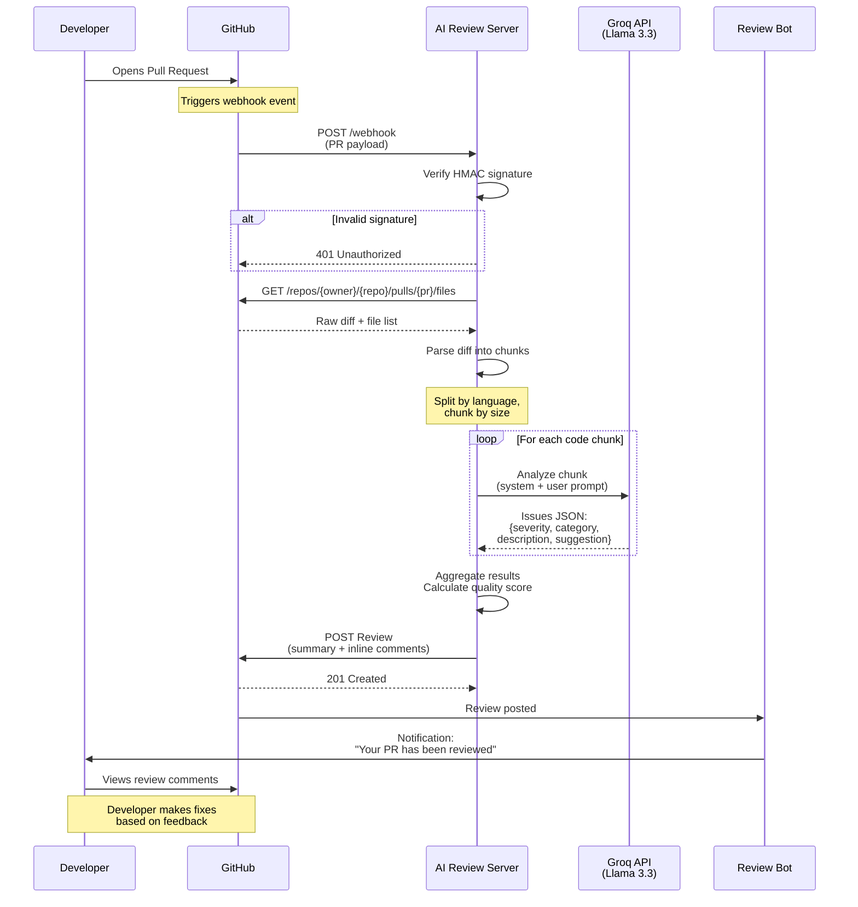
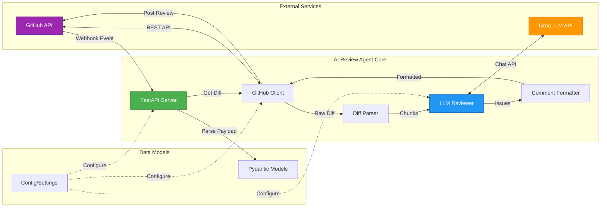
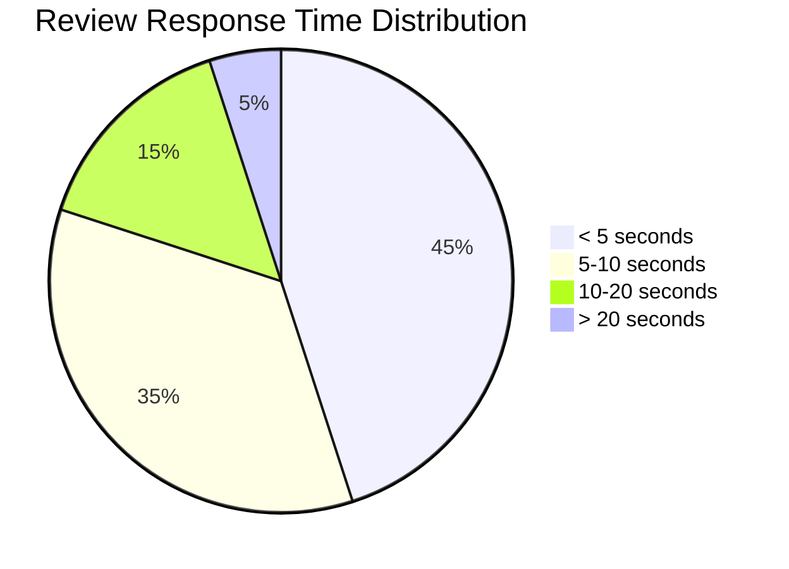
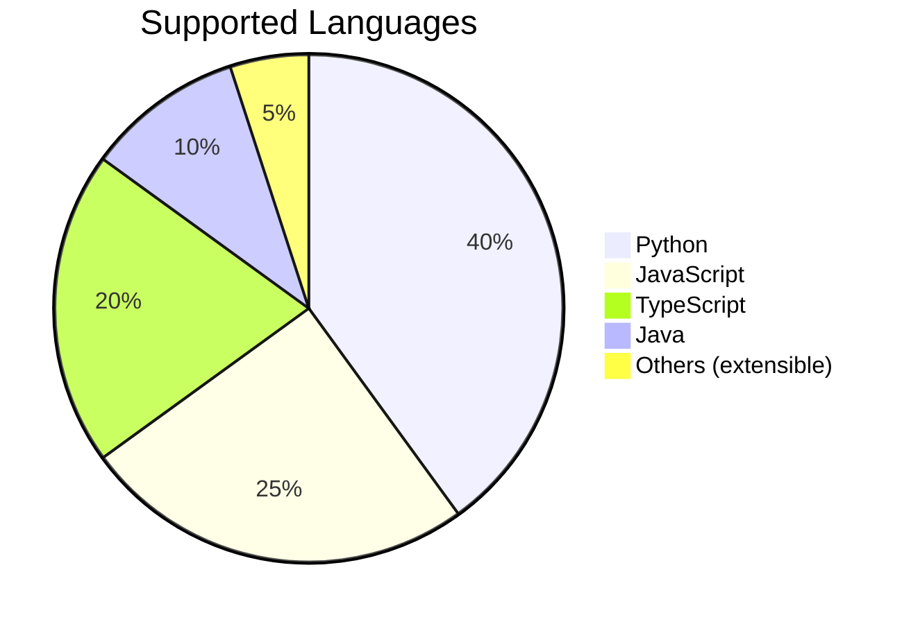

# Enhanced Documentation with Visual Examples

This document contains visual mockups and examples to be integrated into the README.

## 1. Example: AI Code Review Inline Comment


**Mockup of AI Code Review Comment:**

```
┌─────────────────────────────────────────────────────────────────────┐
│ 🟡 WARNING — Potential Null Pointer Risk                           │
│                                                                     │
│ Category: bug                                                       │
│                                                                     │
│ The variable `user_data` is accessed without checking if it's      │
│ None. This could lead to an AttributeError at runtime if the       │
│ database query returns no results.                                 │
│                                                                     │
│ Suggested fix:                                                      │
│ ┌─────────────────────────────────────────────────────────────┐   │
│ │ # Add null check before accessing                           │   │
│ │ if user_data is None:                                       │   │
│ │     return {"error": "User not found"}                      │   │
│ │ return user_data.to_dict()                                  │   │
│ └─────────────────────────────────────────────────────────────┘   │
│                                                                     │
│ 🤖 Posted by AI Code Review Agent                                  │
└─────────────────────────────────────────────────────────────────────┘
```

## 2. Example: PR Summary Comment

```
┌────────────────────────────────────────────────────────────────────┐
│ 🤖 AI Code Review Summary                                          │
│                                                                    │
│ Quality Score: 7.5/10 🟢🟢🟢🟢🟢🟢🟢🟢⚫⚫                          │
│                                                                    │
│ ┌──────────────────────┬──────────┐                               │
│ │ Metric               │ Count    │                               │
│ ├──────────────────────┼──────────┤                               │
│ │ Total Issues         │ 5        │                               │
│ │ 🔴 Critical          │ 1        │                               │
│ │ 🟡 Warnings          │ 3        │                               │
│ │ Files Reviewed       │ 8        │                               │
│ └──────────────────────┴──────────┘                               │
│                                                                    │
│ Summary: Found 5 issue(s) across 8 file(s). Overall quality       │
│ score: 7.5/10.                                                     │
│                                                                    │
│ 📁 File Breakdown                                                  │
│                                                                    │
│ - `src/app.py` — ⚠️ 2 issue(s)                                    │
│ - `src/github_client.py` — ✅                                     │
│ - `src/llm_reviewer.py` — ⚠️ 1 issue(s)                           │
│ - `src/diff_parser.py` — ✅                                       │
│ - `src/models.py` — ⚠️ 2 issue(s)                                 │
│                                                                    │
│ ---                                                                │
│ Powered by AI Code Review Agent 🤖                                 │
└────────────────────────────────────────────────────────────────────┘
```

## 3. Detailed Workflow Sequence Diagram



## 4. Architecture Component Interaction



## 5. Performance Metrics (Example)



## 6. Language Support



## 7. Usage Statistics Example

```
┌─────────────────────────────────────────────────────────┐
│ 📊 Project Statistics                                   │
├─────────────────────────────────────────────────────────┤
│                                                         │
│  Total Reviews:           127                           │
│  Issues Found:            438                           │
│  Critical Issues:          45 (10%)                     │
│  Avg Quality Score:       8.2/10                        │
│  Avg Review Time:         7.3s                          │
│                                                         │
│  Top Issue Categories:                                  │
│    1. Best Practice    35%  ████████████████████        │
│    2. Code Style       30%  ████████████████            │
│    3. Bugs             20%  ███████████                 │
│    4. Security         10%  █████                       │
│    5. Performance       5%  ███                         │
│                                                         │
└─────────────────────────────────────────────────────────┘
```
